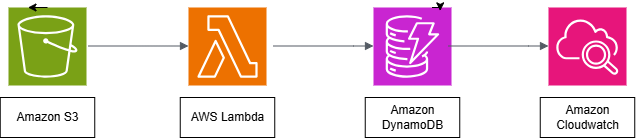

# AWS Serverless Data Pipeline: S3 → Lambda → DynamoDB

### 🧩 Project Overview
This project demonstrates a **serverless data ingestion pipeline** using AWS services — **S3, Lambda, and DynamoDB**.  
Whenever a CSV file is uploaded to the S3 bucket, a Lambda function automatically reads the data and inserts it into a DynamoDB table.

---

### ⚙️ Architecture


**Flow:**
1. File uploaded to **Amazon S3**
2. **S3 Event Notification** triggers **AWS Lambda**
3. Lambda reads and parses the file
4. **Lambda inserts data into DynamoDB**

---

### 🧠 Skills Demonstrated
- Event-driven architecture using AWS
- S3 to Lambda integration
- Lambda to DynamoDB data insertion
- IAM roles and permissions management
- Serverless automation

---

### 📄 Sample CSV
```csv
id,name,age,city
1,Piyush,28,Hyderabad
2,Raj,25,Delhi
3,Aditi,30,Mumbai
4,Neha,27,Bangalore
